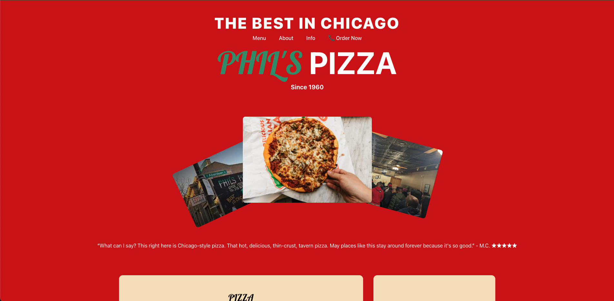
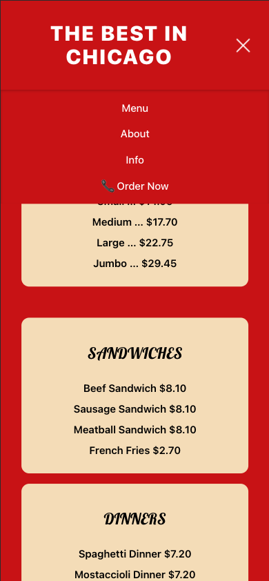

# Phil's Pizza 🍕

A responsive React web app for **Phil's Pizza**, a southside Chicago pizzeria.  
The site features the full menu, about section, contact details, hours, and location — all optimized for desktop and mobile screens.

Visit the website [here](https://philspizzachicago.netlify.app/)!

---

## 🚀 Features

- 📱 **Mobile-first design** – Responsive layout for all devices  
- 🍕 **Full Menu** – Pizzas, sandwiches, and dinners with clear pricing  
- 🏠 **About Us Section** – Story and history of Phil’s Pizza  
- 📍 **Contact & Location** – Phone numbers, address, and embedded social links  
- 🔗 **Social Media Integration** – Facebook and Yelp links via [react-social-icons](https://www.npmjs.com/package/react-social-icons)  
- 🎨 **Custom Styling** – Red/white theme with [Google Fonts](https://fonts.google.com/) (Lobster) for branding  

---

## 🖼️ Screenshots

### 💻 Desktop View

### 📱 Mobile View

## 🛠️ Technologies Used

- **React** (Vite for fast development)  
- **CSS** for custom styling (responsive flexbox layout)  
- **Google Fonts** (Lobster) for branding typography  
- **react-social-icons** for social media links  
- **Netlify** (deployment)  

---

